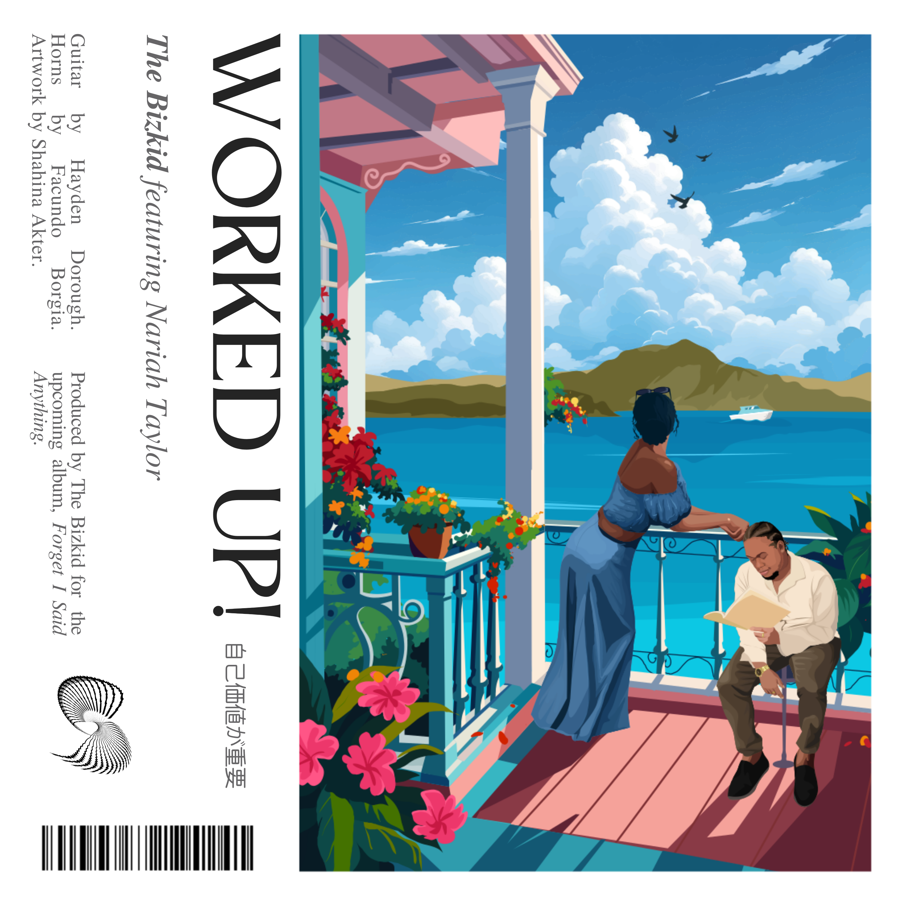

---
# Worked Up! release page as index

layout:    default
Title:     Worked Up!
permalink: /
---
<html lang="en">

<!-- Meta information to call here -->
<head>

    <!-- Metadata -->
    <meta charset="utf-8">
    <meta name="author" content="{{ site.author }}">
    <meta name="description" content="{{ site.description }}">
    <meta name="viewport" content="width=device-width, initial-scale=1">

    <!-- Page Title -->
    <title>Worked Up! - {{ site.title }}</title>

    <!-- CSS -->
    <link rel="preconnect" href="https://fonts.googleapis.com">
    <link rel="preconnect" href="https://fonts.gstatic.com" crossorigin>
    <link href="https://fonts.googleapis.com/css2?family=Lora&family=Roboto:ital,wght@0,400;0,700;1,400;1,700&display=swap" rel="stylesheet">
    <link href="https://unpkg.com/aos@2.3.1/dist/aos.css" rel="stylesheet">
    <link href="/assets/css/tailwind.css" rel="stylesheet">

    <!-- Favicons -->
    <!-- <link rel="shortcut icon" href="/assets/images/icons/bizkid.ico" />
    <link rel="apple-touch-icon" href="/assets/images/icons/bizkid.ico" /> -->

</head>

<body class="bg-sl-bgcolor text-sl-black text-center">

    <!-- Necessary loader and site header information -->

    <!-- Site content to use in each unique page -->

    <!-- Cover Hero Section -->
    <section>
    
        

            <!-- Blurred banner Image -->
            

            <!-- Album Cover -->
            

                
            

    
        

    
    </section>

    <!-- Music Player Section -->
    <!-- TODO: Implement Player functionalities -->
    <section>
        

    </section>

    <!-- Song Info Section -->
    <section>
        <h1 class="text-6xl font-roboto font-bold mt-8">Worked Up!</h1>
        <h2 class="text-xl font-lora italic my-4">by <b>The Bizkid</b></h2>
    </section>
    
    

    <!-- Links Section -->
    <section class="font-roboto">
    
        <h2 class="text-xl font-bold italic mt-4"><b>Stream now:</b></h2>

        <!-- Spotify -->
        <a href="https://open.spotify.com/track/419WEVULjmEInAtYh4W1xY?si=47cd864d64c44607">
            

                <h2 class="text-xl text-white font-bold italic flex items-center justify-center">Spotify</h2>
            

        </a>

        <!-- Apple Music -->
        <a href="https://music.apple.com/us/album/worked-up-feat-nariah-taylor/1758385676?i=1758385677">
            

                <h2 class="text-xl text-white font-bold italic flex items-center justify-center">Apple Music</h2>
            

        </a>

        <!-- Tidal -->
        <a href="https://tidal.com/browse/album/376194217">
            

                <h2 class="text-xl text-white font-bold italic flex items-center justify-center">Tidal</h2>
            

        </a>

        <!-- Youtube -->
        <a href="https://youtu.be/vHVLcIrz9HQ?si=Il4voMD4NBXgRUut">
            

                <h2 class="text-xl text-white font-bold italic flex items-center justify-center">Youtube</h2>
            

        </a>

        <!-- Soundcloud -->
        <a href="https://soundcloud.com/thebizkid/worked-up?si=6d7de5dc912d4a48b75aba0f198fcbd0&utm_source=clipboard&utm_medium=text&utm_campaign=social_sharing">
            

                <h2 class="text-xl text-white font-bold italic flex items-center justify-center">Soundcloud</h2>
            

        </a>

        <!-- Bandcamp -->
        <a href="https://thebizkid.bandcamp.com/track/worked-up">
            

                <h2 class="text-xl text-white font-bold italic flex items-center justify-center">Bandcamp</h2>
            

        </a>
    
    </section>

    <!-- Footer  -->
    <section>

        
Released July 19, 2024

        

        
Page designed & developed   by Darius Brown. <a href="https://github.com/dariustb/SongLinktree" class="underline text-sl-darkblue">View GitHub Repo</a>
 
    
    </section>

    <!-- Necessary script calls to make site work -->
    

</body>

</html>
