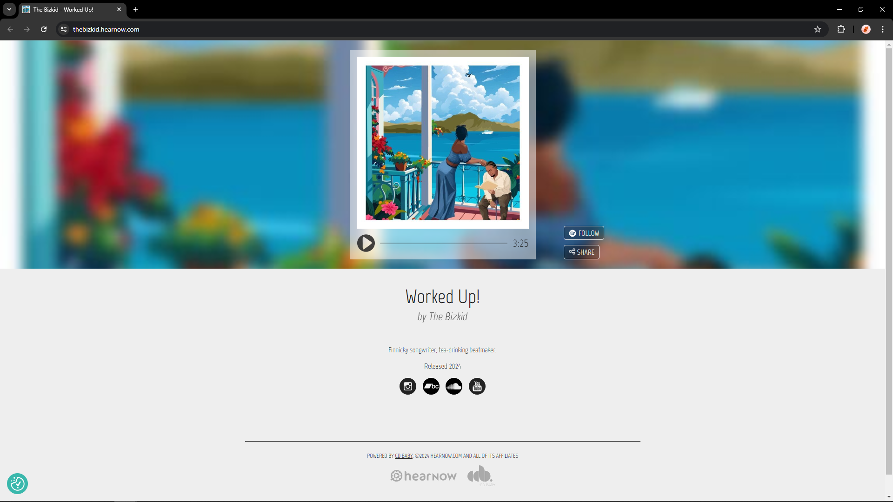
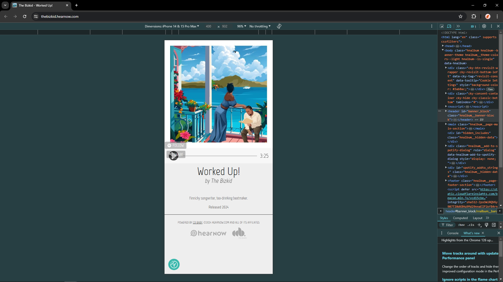
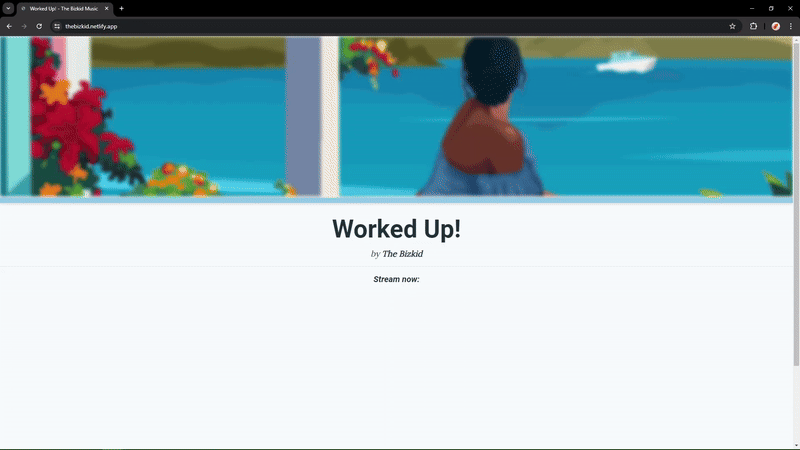

<!-- PROJECT SHIELDS -->
![GitHub repo size][repo-size]
[![Netlify Status][netlifystat]][netlifystat-url]
<!-- [![Github Pages Status][gpages]][gpages-url] -->

<!-- PROJECT LOGO -->
 

  <h1 align="center">Song Linktree</h1>

<!-- PROJECT DEMO-->

  

    Jekyll Linktree site to provide quicklinks for new released music
     
    <a href="https://dariustb.github.io/SongLinktree/"><strong>Explore the docs »</strong></a>
     
     
    <a href="https://github.com/dariustb/SongLinktree/issues">Report Bug</a>
    ·
    <a href="https://github.com/dariustb/SongLinktree/issues">Request Feature</a>
  

<!-- ABOUT THE PROJECT -->
## About The Project
### Background 😠
I purchased the service of HearNow.com to create and host a webpage that showcases my newly released song and offer weblinks to all of the streaming platforms that play the music. This way my audience can find the song easily by going to this page that I'd provide on social media.

HearNow didn't provide the links to the streaming platforms for my audience.

After the first day of HearNow failing to deliver, I decided to create my own page to solve the immediate problem for listeners and fans alike.

### Features ✨
This is a simply designed site whose goal is to provide links to the public, and it delivered on that.

This page has viewport-responsive design to allow ease of use in both mobile and desktop environments. Buttons that signify press with mobile and highlight on hover with desktop. Links are provided for the top 7 applications that I could forsee my audience using.

### Built With
* ![Jekyll][jekyll.io]
* ![Tailwind][tailwind.css]
* ![Jinja][jinja.io]
* ![Figma][figma.io]
* ![Netlify][netlify.io]

### Contributing
This website is a personal project and is not currently open to contributions. However, if you [find a bug](https://github.com/dariustb/SongLinktree/issues) or want to [suggest for improvement](https://github.com/dariustb/SongLinktree/issues), please feel free to open an issue on the GitHub repository.

<!-- CI Test badges -->
[gpages]:       https://github.com/dariustb/SongLinktree/actions/workflows/pages/pages-build-deployment/badge.svg
[gpages-url]:   https://github.com/dariustb/SongLinktree/actions/workflows/pages/pages-build-deployment

[netlifystat]:  https://api.netlify.com/api/v1/badges/d7c0bc03-a588-4a9f-a4fb-062a6a725386/deploy-status
[netlifystat-url]: https://app.netlify.com/sites/thebizkid/deploys

<!-- Markdown Badges -->
[repo-size]:    https://img.shields.io/github/repo-size/dariustb/SongLinktree
[jekyll.io]:    https://img.shields.io/badge/jekyll-CC342D.svg?style=for-the-badge&logo=jekyll&logoColor=white
[tailwind.css]: https://img.shields.io/badge/tailwindcss-%2338B2AC.svg?style=for-the-badge&logo=tailwind-css&logoColor=white
[jinja.io]:     https://img.shields.io/badge/jinja-white.svg?style=for-the-badge&logo=jinja&logoColor=black
[figma.io]:     https://img.shields.io/badge/figma-%23F24E1E.svg?style=for-the-badge&logo=figma&logoColor=white
[netlify.io]:   https://img.shields.io/badge/netlify-%23000000.svg?style=for-the-badge&logo=netlify&logoColor=#00C7B7
